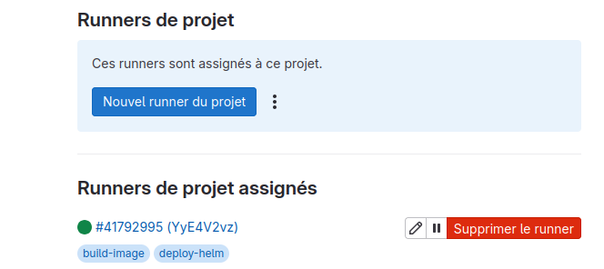

# Test-Technique-BNP

# APPLICATION 

- FRONTEND : REACT JS 
- BACKEND : SPRING BOOT (JAVA 17)
- DB : AWS PostgreSQL

# LES ÉTAPES AVANT DE LANCER LA PIPELINE CI SUR GITLAB 

- Monter un cluster kind avec la commande kind  " kind create cluster --name kind " 
- Installer nginx ingress controller  " kubectl apply -f https://raw.githubusercontent.com/kubernetes/ingress-nginx/main/deploy/static/provider/kind/deploy.yaml " 
- Si y'a des soucis avec l'ingress controller et l'ingress faudra vérifier le service nginx ingress controller dans le namespace "ingress-nginx" ( NodePort svc )  et vérifier dans le fichier de configuration d'ingress y'a l'annotation de " kubernetes.io/ingress.class: "nginx" "  

- EXTRAIRE Le port (NodePort) de service nginx ingress controller dans le cas de l'exercice ( 30947 )

- Un gitlab-runner en mode execution sur la machine locale ( executor = shell ou docker (avec une image Kaniko sur la CI) ) 

 

# ÉTAPE POUR ACCEDER À L'APPLICATION

- Ajout de l'adresse de node de cluster (controle plane dans le cas de cluster kind) dans "/etc/hosts"  associé à la valeur de Host définie en fichier de configuration Ingress (host)

# ADRESSE À TRAVERS LAQUELLE L'APPLICATION SERA ACCESSIBLE SUR LA MACHINE LOCALE 

- http://myapplication.local.test:30947   ( 30947 varie d'une machine à une autre c'est le node port de svc nginx ingress controller ) 

# AFFICHAGE DE FRONT ATTENDU 

- Simple HELLO WORLD avec un messge envoyé par le backend avec l'état de connexion avec la base de donnée ( une base de donnée hebergée sur du cloud AWS dans le cas de cette application )   

# LIEN VERS VERS UNE PIPELINE REUSSIE 

- https://gitlab.com/Hassen_exalte/test-technique/-/pipelines/1490856752
